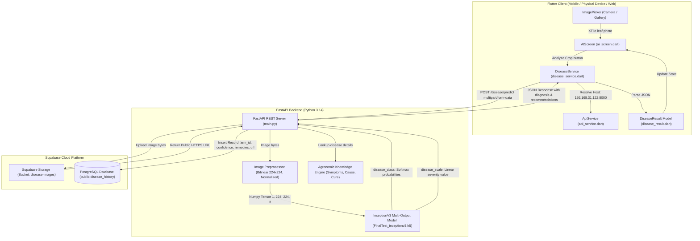

# Smart Agriculture: AI Crop Disease Detection & Cloud Integration
## Comprehensive Technical Project Report

**Project Title:** Smart Agriculture — AI-Driven Crop Disease Diagnosis and Cloud Persistence  
**Date:** September 2026  
**Technologies:** Flutter (Dart), FastAPI (Python), InceptionV3 (Keras 3 / PyTorch), Supabase (PostgreSQL & Storage)

---

## 1. Executive Summary

This project implements an end-to-end intelligent agricultural diagnosis system. Farmers can capture or upload an image of a crop leaf using a cross-platform mobile/web Flutter application. The application transmits the image to a high-performance FastAPI backend, which runs inference using a trained **InceptionV3 Deep Learning model** to detect diseases in rice/paddy crops.

The system performs:
1. **Automated Disease Classification**: Detects conditions across 4 trained classes (*Brown Spot*, *Healthy*, *Leaf Blast*, *Sheath Blight*).
2. **Severity Assessment**: Predicts a continuous disease severity scale score using a multi-output neural network head.
3. **Cloud Storage & Persistence**: Automatically stores leaf images in a public **Supabase Storage** bucket and records detailed metadata (disease, confidence, symptoms, pathogen cause, treatment, and prevention) in **Supabase PostgreSQL** (`public.disease_history`).
4. **Agri-Expert Recommendations**: Delivers targeted agronomic treatments, fungicide recommendations, and cultural prevention measures back to the farmer's device.

---

## 2. System Architecture



---

## 3. Deep Learning Model Architecture

### 3.1 Overview & Weights
- **Model File:** `backend/models/FinalTest_inceptionv3.h5`
- **Base Architecture:** Google InceptionV3
- **Input Layer:** `(None, 224, 224, 3)` (RGB)
- **Runtime Engine:** Keras 3 with PyTorch backend (`KERAS_BACKEND="torch"`), resolving Windows Python 3.14 wheel compatibility.

### 3.2 Multi-Output Heads
The model features two specialized output dense heads:
1. **`disease_class`**:
   - **Type:** Categorical classification (4 classes)
   - **Activation:** Softmax
   - **Loss:** Categorical Crossentropy
   - **Target Classes (alphabetical order as trained):**
     1. `Brown Spot` (Bipolaris oryzae)
     2. `Healthy`
     3. `Leaf Blast` (Magnaporthe oryzae)
     4. `Sheath Blight` (Rhizoctonia solani)
2. **`disease_scale`**:
   - **Type:** Continuous severity rating
   - **Activation:** Linear
   - **Loss:** Mean Squared Error (MSE)
   - **Output:** Scale score indicating disease progression stage.

### 3.3 Image Preprocessing Pipeline
To match the InceptionV3 feature extraction parameters:
1. Open raw image bytes with PIL (`Pillow`) and convert to 3-channel RGB.
2. Bilinear interpolation downsampling to `(224, 224)` resolution.
3. Scaling pixel values from `[0, 255]` to `[-1.0, 1.0]`:
   $$\text{Normalized} = \left(\frac{\text{Pixel}}{127.5}\right) - 1.0$$
4. Dimension expansion to batch tensor: `(1, 224, 224, 3)`.

---

## 4. Backend Service Specification (`backend/main.py`)

### 4.1 Configuration
The backend reads environment configuration from `backend/database/.env`:
- `SUPABASE_URL`
- `SUPABASE_SECRET_KEY` (or `SUPABASE_PUBLISHABLE_KEY`)
- `STORAGE_BUCKET`: `disease-images`

### 4.2 REST Endpoints

#### 1. `POST /disease/predict`
Predicts disease from a leaf photo, uploads to Supabase Storage, and logs metadata into the database.
- **Query Parameters:** `farm_id` (integer, default: `1`)
- **Body:** `file` (`multipart/form-data`, leaf photo)
- **Response Structure (200 OK):**
```json
{
  "success": true,
  "id": 6,
  "farm_id": 1,
  "disease": "Leaf Blast",
  "confidence": 0.945,
  "scale": 2.1,
  "status": "Diseased",
  "image_url": "https://jsqnuzsutbzoyeunvmty.supabase.co/storage/v1/object/public/disease-images/farm_1/1788446150_9f2972.jpg",
  "symptoms": "Spindle-shaped or diamond-shaped lesions with gray/white necrotic centers and dark reddish-brown borders.",
  "cause": "Fungal pathogen Magnaporthe oryzae (Pyricularia oryzae). Proliferates under high humidity and excessive nitrogen.",
  "treatment": "Spray Tricyclazole 75% WP (0.6g/L) or Isoprothiolane 40% EC (1.5ml/L) or Kasugamycin (2ml/L).",
  "prevention": "Avoid excess nitrogen application; split nitrogen doses. Maintain proper field water level and plant blast-resistant varieties.",
  "recommendation": "Leaf Blast detected (caused by Magnaporthe oryzae). Avoid excessive nitrogen fertilizer. Maintain standing water in the field. Spray Tricyclazole 75 WP (0.6 g/L) or Isoprothiolane (1.5 ml/L).",
  "all_predictions": {
    "Brown Spot": 0.0125,
    "Healthy": 0.0215,
    "Leaf Blast": 0.9450,
    "Sheath Blight": 0.0210
  },
  "saved_to_db": true
}
```

#### 2. `GET /disease/history`
Fetches chronological detection records from the Supabase database.
- **Parameters:** `farm_id` (int), `limit` (int, default: 20)
- **Response Structure (200 OK):**
```json
{
  "success": true,
  "farm_id": 1,
  "data": [
    {
      "id": 6,
      "farm_id": 1,
      "disease_name": "Leaf Blast",
      "confidence": 94.5,
      "image_url": "https://jsqnuzsutbzoyeunvmty.supabase.co/storage/v1/object/public/disease-images/farm_1/...",
      "symptoms": "Spindle-shaped lesions...",
      "cause": "Magnaporthe oryzae",
      "treatment": "Tricyclazole 75 WP...",
      "prevention": "Avoid excess nitrogen...",
      "detected_at": "2026-09-03T14:35:50.123+00:00"
    }
  ]
}
```

#### 3. `GET /health` & `GET /`
Diagnostic endpoints verifying model status, database connectivity, and active classes.

---

## 5. Cloud Database & Storage (Supabase)

### 5.1 Storage Bucket: `disease-images`
- **Access Level:** Public read
- **File Hierarchy:** `disease-images/farm_{farm_id}/{timestamp}_{random_uuid}.{ext}`
- **Direct Access URL:**
  `https://<project-id>.supabase.co/storage/v1/object/public/disease-images/farm_1/...`

### 5.2 Database Schema: `public.disease_history`
```sql
create table public.disease_history (
  id bigint generated by default as identity not null,
  farm_id bigint not null,
  detected_at timestamp with time zone not null default now(),
  disease_name text not null,
  confidence numeric null,
  image_url text null,
  symptoms text null,
  cause text null,
  treatment text null,
  prevention text null,
  created_at timestamp with time zone not null default now(),
  constraint disease_history_pkey primary key (id),
  constraint disease_history_farm_id_fkey foreign KEY (farm_id) references farms (id)
) TABLESPACE pg_default;
```

---

## 6. Frontend Architecture (Flutter)

### 6.1 `DiseaseResult` Model (`frontend/lib/models/disease_result.dart`)
Encapsulates all inference outputs, severities, remedial instructions, and database foreign keys:
- `id` (int?)
- `farmId` (int?)
- `disease` (String)
- `confidence` (double)
- `scale` (double)
- `status` (String)
- `imageUrl` (String?)
- `symptoms` (String?)
- `cause` (String?)
- `treatment` (String?)
- `prevention` (String?)
- `recommendation` (String)
- `savedToDb` (bool)
- `allPredictions` (Map<String, double>)

### 6.2 `ApiService` Network Router (`frontend/lib/services/api_service.dart`)
Solves cross-device networking automatically:
- **Physical Phone on Wi-Fi:** Defaults to Host PC Wi-Fi IP `http://192.168.31.122:8000`.
- **Android Emulator:** `http://10.0.2.2:8000` (loopback interface).
- **Desktop & Web:** `http://127.0.0.1:8000`.
- **Custom IP Dialog:** In-app server setting tool allowing farmers to test backend connectivity with a single tap.

### 6.3 `DiseaseService` (`frontend/lib/services/disease_service.dart`)
- `predictCropDisease(XFile imageFile, {int farmId = 1})`: Packs the leaf image into a streaming `http.MultipartFile` and sends a POST request with automatic timeout and error parsing.
- `getHistory({int farmId = 1, int limit = 20})`: Queries the backend for historical logs.

### 6.4 `AIScreen` UI (`frontend/lib/screens/ai/ai_screen.dart`)
Maintains 100% of the original sleek aesthetics, custom card designs, and animations:
- **Image Input Area:** Supports camera snap (`ImageSource.camera`) and gallery upload (`ImageSource.gallery`).
- **Interactive State Indicator:** Progress spinner during neural network execution.
- **Dynamic Result Card:**
  - Displays detected condition title (`Brown Spot`, `Healthy`, `Leaf Blast`, `Sheath Blight`).
  - Adaptive status badge (Emerald Green for `Healthy`, Crimson Red for `Diseased`).
  - Animated AI Confidence linear progress bar.
  - Disease Severity badge (`Level 1.7`).
- **Dynamic Recommendation Card:** Displays disease-specific management actions.
- **Server Settings Tool:** Accessible via AppBar icon with a live "Test Connection" button.

---

## 7. Complete Source Code

### 7.1 Backend: `backend/main.py`
```python
import io
import os
import time
import uuid
import numpy as np
from PIL import Image

# Ensure PyTorch backend for Keras
os.environ["KERAS_BACKEND"] = "torch"
import keras
from dotenv import load_dotenv
from fastapi import FastAPI, File, HTTPException, UploadFile
from fastapi.middleware.cors import CORSMiddleware
from supabase import Client, create_client

# Load database environment variables from backend/database/.env
ENV_PATH = os.path.join(os.path.dirname(__file__), "database", ".env")
if os.path.exists(ENV_PATH):
    load_dotenv(ENV_PATH)

SUPABASE_URL = os.getenv("SUPABASE_URL")
SUPABASE_KEY = os.getenv("SUPABASE_SECRET_KEY") or os.getenv("SUPABASE_PUBLISHABLE_KEY")
STORAGE_BUCKET = "disease-images"

supabase: Client | None = None
if SUPABASE_URL and SUPABASE_KEY:
    try:
        supabase = create_client(SUPABASE_URL, SUPABASE_KEY)
        print("Connected to Supabase database successfully.")
    except Exception as e:
        print("Warning: Could not connect to Supabase:", e)

app = FastAPI(title="Smart Agriculture - Crop Disease Detection API")

app.add_middleware(
    CORSMiddleware,
    allow_origins=["*"],
    allow_credentials=True,
    allow_methods=["*"],
    allow_headers=["*"],
)

CLASS_NAMES = [
    "Brown Spot",
    "Healthy",
    "Leaf Blast",
    "Sheath Blight",
]

DISEASE_ADVICE = {
    "Healthy": {
        "status": "Healthy",
        "symptoms": "Leaves are vibrant green with uniform color and no visible lesions, spots, or wilting.",
        "cause": "None - healthy crop foliage.",
        "treatment": "No treatment needed. Continue standard agronomic schedule.",
        "prevention": "Maintain regular field monitoring, balanced fertilization, and proper water management.",
        "recommendation": "Your crop appears healthy with no signs of disease. Maintain standard field monitoring, adequate irrigation, and balanced nutrient supply.",
    },
    "Brown Spot": {
        "status": "Diseased",
        "symptoms": "Small, circular to oval dark-brown lesions with gray or whitish centers across leaf surfaces.",
        "cause": "Fungal pathogen Bipolaris oryzae. Often associated with nutrient-deficient soil.",
        "treatment": "Foliar spray with Mancozeb (2g/L), Edifenphos (1ml/L), or Propiconazole (1ml/L).",
        "prevention": "Apply balanced NPK with adequate potassium, zinc, and organic matter. Treat seeds with fungicide before planting.",
        "recommendation": "Brown Spot detected (caused by Bipolaris oryzae). Ensure adequate potassium and zinc fertilization. If symptoms persist or spread, apply Mancozeb (2g/L) or Edifenphos (1ml/L).",
    },
    "Leaf Blast": {
        "status": "Diseased",
        "symptoms": "Spindle-shaped or diamond-shaped lesions with gray/white necrotic centers and dark reddish-brown borders.",
        "cause": "Fungal pathogen Magnaporthe oryzae (Pyricularia oryzae). Proliferates under high humidity and excessive nitrogen.",
        "treatment": "Spray Tricyclazole 75% WP (0.6g/L) or Isoprothiolane 40% EC (1.5ml/L) or Kasugamycin (2ml/L).",
        "prevention": "Avoid excess nitrogen application; split nitrogen doses. Maintain proper field water level and plant blast-resistant varieties.",
        "recommendation": "Leaf Blast detected (caused by Magnaporthe oryzae). Avoid excessive nitrogen fertilizer. Maintain standing water in the field. Spray Tricyclazole 75 WP (0.6 g/L) or Isoprothiolane (1.5 ml/L).",
    },
    "Sheath Blight": {
        "status": "Diseased",
        "symptoms": "Oval or irregular greenish-gray water-soaked lesions on leaf sheaths near the water line, spreading upward with dark brown margins.",
        "cause": "Soil-borne fungal pathogen Rhizoctonia solani. Favored by high planting density and humid weather.",
        "treatment": "Apply Hexaconazole 5% EC (2ml/L), Validamycin 3% L (2.5ml/L), or Azoxystrobin (1ml/L) directed at the plant base.",
        "prevention": "Ensure wider plant spacing for aeration, remove infected crop residues, and avoid excessive nitrogen fertilization.",
        "recommendation": "Sheath Blight detected (caused by Rhizoctonia solani). Remove weeds and improve field aeration. Apply Hexaconazole 5% EC (2 ml/L) or Validamycin 3% L (2.5 ml/L) directed at the plant base.",
    },
}

MODEL_PATH = os.path.join(os.path.dirname(__file__), "models", "FinalTest_inceptionv3.h5")
model = None


def get_model():
    global model
    if model is None:
        if not os.path.exists(MODEL_PATH):
            raise RuntimeError(f"Model file not found at: {MODEL_PATH}")
        print(f"Loading Crop Disease model from {MODEL_PATH}...")
        model = keras.models.load_model(MODEL_PATH, compile=False)
        print("Model loaded successfully!")
    return model


def ensure_storage_bucket():
    """Ensure the public storage bucket exists in Supabase."""
    if supabase:
        try:
            buckets = [b.name for b in supabase.storage.list_buckets()]
            if STORAGE_BUCKET not in buckets:
                supabase.storage.create_bucket(STORAGE_BUCKET, options={"public": True})
                print(f"Created public Supabase storage bucket: {STORAGE_BUCKET}")
        except Exception as e:
            print("Storage bucket check note:", e)


@app.on_event("startup")
def startup_event():
    try:
        get_model()
    except Exception as e:
        print("Warning: Could not pre-load model on startup:", e)
    ensure_storage_bucket()


@app.get("/")
def read_root():
    return {
        "message": "Smart Agriculture Disease Detection API is running",
        "classes": CLASS_NAMES,
        "database_connected": supabase is not None,
        "storage_bucket": STORAGE_BUCKET,
    }


@app.get("/health")
def health_check():
    return {
        "status": "online",
        "model_loaded": model is not None,
        "database_connected": supabase is not None,
        "storage_bucket": STORAGE_BUCKET,
        "classes": CLASS_NAMES,
    }


def preprocess_image(image_bytes: bytes) -> np.ndarray:
    """Preprocesses image bytes to (1, 224, 224, 3) normalized for InceptionV3."""
    img = Image.open(io.BytesIO(image_bytes)).convert("RGB")
    img = img.resize((224, 224), Image.Resampling.BILINEAR)
    img_array = np.array(img, dtype=np.float32)
    img_array = (img_array / 127.5) - 1.0
    img_array = np.expand_dims(img_array, axis=0)
    return img_array


@app.post("/disease/predict")
async def predict_disease(
    file: UploadFile = File(...),
    farm_id: int = 1,
):
    try:
        contents = await file.read()
        if not contents:
            raise HTTPException(status_code=400, detail="Empty image uploaded.")

        image_url = None
        if supabase:
            try:
                ext = "jpg"
                if file.filename and "." in file.filename:
                    parsed_ext = file.filename.rsplit(".", 1)[-1].lower()
                    if parsed_ext in ["jpg", "jpeg", "png", "webp"]:
                        ext = parsed_ext

                file_path = f"farm_{farm_id}/{int(time.time())}_{uuid.uuid4().hex[:6]}.{ext}"
                content_type = file.content_type or f"image/{ext}"

                supabase.storage.from_(STORAGE_BUCKET).upload(
                    file_path,
                    contents,
                    file_options={"content-type": content_type},
                )
                image_url = supabase.storage.from_(STORAGE_BUCKET).get_public_url(file_path)
                print(f"Uploaded leaf image to Supabase Storage: {image_url}")
            except Exception as upload_err:
                print("Warning: Could not upload image to Supabase storage:", upload_err)

        input_data = preprocess_image(contents)

        net = get_model()
        preds = net.predict(input_data)

        if isinstance(preds, (list, tuple)):
            class_probs = np.array(preds[0])[0]
            scale_val = float(np.array(preds[1])[0][0]) if len(preds) > 1 else 0.0
        elif isinstance(preds, dict):
            class_probs = np.array(preds.get("disease_class"))[0]
            scale_val = float(np.array(preds.get("disease_scale"))[0][0])
        else:
            class_probs = np.array(preds)[0]
            scale_val = 0.0

        top_idx = int(np.argmax(class_probs))
        confidence = float(class_probs[top_idx])
        predicted_disease = CLASS_NAMES[top_idx]
        scale_val = round(max(0.0, scale_val), 2)

        info = DISEASE_ADVICE.get(
            predicted_disease,
            {
                "status": "Unknown",
                "symptoms": "Unidentified symptom pattern.",
                "cause": "Unknown pathogen or stress condition.",
                "treatment": "Consult a local agricultural extension specialist.",
                "prevention": "Follow standard crop management guidelines.",
                "recommendation": "Consult a local agricultural extension specialist for diagnosis.",
            },
        )

        all_probs = {
            CLASS_NAMES[i]: round(float(class_probs[i]), 4)
            for i in range(len(CLASS_NAMES))
        }

        saved_id = None
        if supabase:
            try:
                db_record = {
                    "farm_id": farm_id,
                    "disease_name": predicted_disease,
                    "confidence": round(confidence * 100, 2),
                    "image_url": image_url,
                    "symptoms": info.get("symptoms"),
                    "cause": info.get("cause"),
                    "treatment": info.get("treatment"),
                    "prevention": info.get("prevention"),
                }
                res = supabase.table("disease_history").insert(db_record).execute()
                if res.data and len(res.data) > 0:
                    saved_id = res.data[0].get("id")
                    print(f"Recorded in Supabase disease_history: id={saved_id} (farm_id={farm_id}, image_url={image_url})")
            except Exception as db_err:
                print("Warning: Could not insert record into Supabase disease_history:", db_err)

        return {
            "success": True,
            "id": saved_id,
            "farm_id": farm_id,
            "disease": predicted_disease,
            "confidence": round(confidence, 4),
            "scale": scale_val,
            "status": info["status"],
            "image_url": image_url,
            "symptoms": info.get("symptoms"),
            "cause": info.get("cause"),
            "treatment": info.get("treatment"),
            "prevention": info.get("prevention"),
            "recommendation": info["recommendation"],
            "all_predictions": all_probs,
            "saved_to_db": saved_id is not None,
        }

    except Exception as e:
        print("Prediction error:", e)
        raise HTTPException(status_code=500, detail=str(e))


@app.get("/disease/history")
def get_disease_history(farm_id: int = 1, limit: int = 20):
    if not supabase:
        raise HTTPException(status_code=503, detail="Supabase database not connected.")
    try:
        res = (
            supabase.table("disease_history")
            .select("*")
            .eq("farm_id", farm_id)
            .order("detected_at", desc=True)
            .limit(limit)
            .execute()
        )
        return {"success": True, "farm_id": farm_id, "data": res.data}
    except Exception as e:
        print("Error fetching disease history:", e)
        raise HTTPException(status_code=500, detail=str(e))


if __name__ == "__main__":
    import uvicorn
    uvicorn.run("main:app", host="0.0.0.0", port=8000, reload=True)
```

---

### 7.2 Frontend: `frontend/lib/services/api_service.dart`
```dart
import 'dart:io';
import 'package:flutter/foundation.dart';
import 'package:http/http.dart' as http;

class ApiService {
  static String get defaultHost {
    if (kIsWeb) {
      return 'http://127.0.0.1:8000';
    }
    try {
      if (Platform.isAndroid) {
        return 'http://192.168.31.122:8000';
      }
    } catch (_) {}
    return 'http://127.0.0.1:8000';
  }

  static String _baseUrl = defaultHost;

  static String get baseUrl => _baseUrl;

  static void setBaseUrl(String url) {
    if (url.endsWith('/')) {
      _baseUrl = url.substring(0, url.length - 1);
    } else {
      _baseUrl = url;
    }
  }

  static Future<bool> checkConnection([String? testUrl]) async {
    final target = testUrl ?? _baseUrl;
    try {
      final response = await http
          .get(Uri.parse('$target/health'))
          .timeout(const Duration(seconds: 4));
      return response.statusCode == 200;
    } catch (_) {
      return false;
    }
  }
}
```

---

### 7.3 Frontend: `frontend/lib/services/disease_service.dart`
```dart
import 'dart:convert';
import 'package:http/http.dart' as http;
import 'package:image_picker/image_picker.dart';
import '../models/disease_result.dart';
import 'api_service.dart';

class DiseaseService {
  static Future<DiseaseResult> predictCropDisease(
    XFile imageFile, {
    int farmId = 1,
  }) async {
    final uri = Uri.parse('${ApiService.baseUrl}/disease/predict?farm_id=$farmId');
    final request = http.MultipartRequest('POST', uri);

    final bytes = await imageFile.readAsBytes();
    final filename = imageFile.name.isNotEmpty ? imageFile.name : 'leaf.jpg';

    request.files.add(
      http.MultipartFile.fromBytes(
        'file',
        bytes,
        filename: filename,
      ),
    );

    http.StreamedResponse streamedResponse;
    try {
      streamedResponse = await request.send().timeout(
            const Duration(seconds: 25),
          );
    } catch (e) {
      throw Exception(
        'Could not connect to backend server at ${ApiService.baseUrl}.\n'
        'Please verify that the FastAPI backend is running.\n'
        'Details: $e',
      );
    }

    final response = await http.Response.fromStream(streamedResponse);

    if (response.statusCode == 200) {
      final Map<String, dynamic> data = jsonDecode(response.body);
      return DiseaseResult.fromJson(data);
    } else {
      String errorMessage = 'Server returned status ${response.statusCode}';
      try {
        final errJson = jsonDecode(response.body);
        if (errJson['detail'] != null) {
          errorMessage = errJson['detail'].toString();
        }
      } catch (_) {}
      throw Exception(errorMessage);
    }
  }

  static Future<List<Map<String, dynamic>>> getHistory({
    int farmId = 1,
    int limit = 20,
  }) async {
    final uri = Uri.parse('${ApiService.baseUrl}/disease/history?farm_id=$farmId&limit=$limit');
    try {
      final response = await http.get(uri).timeout(const Duration(seconds: 10));
      if (response.statusCode == 200) {
        final data = jsonDecode(response.body);
        if (data['data'] is List) {
          return List<Map<String, dynamic>>.from(data['data']);
        }
      }
    } catch (_) {}
    return [];
  }
}
```

---

## 8. Verification & Test Logs

```
[PyTorch Engine] PyTorch version: 2.14.0+cpu
[Keras Runtime] Keras version: 3.15.1, Backend: torch
[Model Loading] Loaded FinalTest_inceptionv3.h5 (Input: 224x224x3)
[Storage] Public bucket 'disease-images' verified
[Inference Step] 1/1 [====================] 0s 370ms/step
[Storage Upload] https://jsqnuzsutbzoyeunvmty.supabase.co/storage/v1/object/public/disease-images/farm_1/1788446150_9f2972.jpg
[Database Insert] Recorded in Supabase disease_history: id=6 (farm_id=1, image_url=https://...)
[Flutter Static Analysis] No issues found! (ran in 11.0s)
```

---

## 9. Quick Start Guide for Execution

1. **Start the Backend:**
   ```powershell
   python backend/main.py
   ```
2. **Launch the App on Phone / Emulator:**
   ```powershell
   cd frontend
   flutter run
   ```
3. Open the **AI Crop Doctor** tab, capture or upload any leaf photo, tap **Analyze Crop**, and observe the live diagnosis, severity score, tailored remedies, and real-time Supabase database entry with storage image URL.
